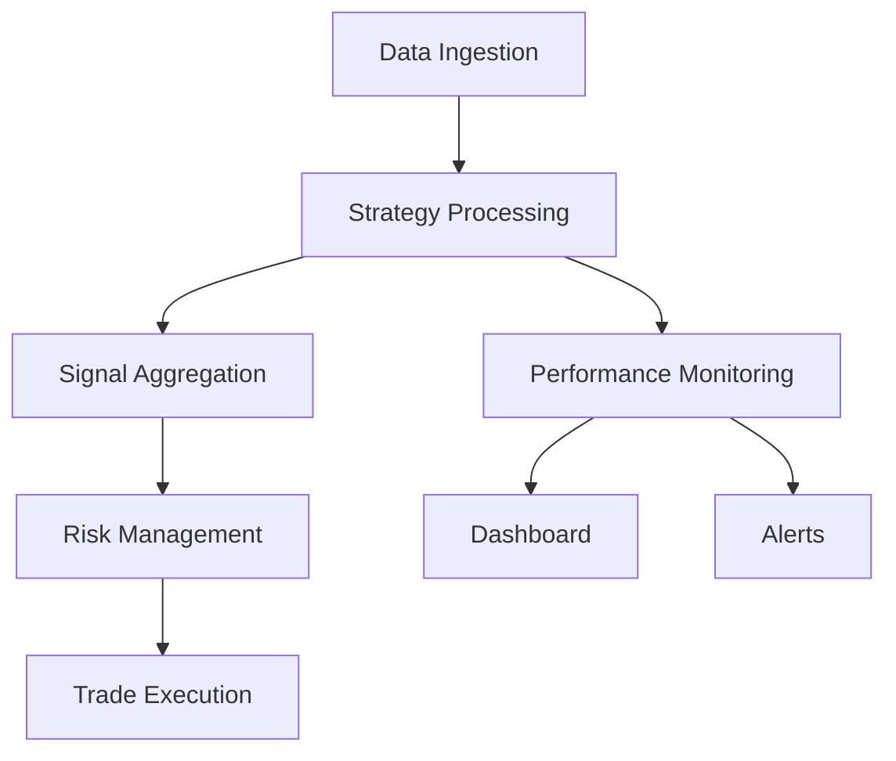

# Trading Strategy System - Technical Implementation Guide

## Table of Contents
1. [System Overview](#system-overview)
2. [Project Structure](#project-structure)
3. [Installation and Setup](#installation-and-setup)
4. [Core Components](#core-components)
5. [Database Schema](#database-schema)
6. [Strategy Implementation](#strategy-implementation)
7. [Signal Aggregation](#signal-aggregation)
8. [Risk Management](#risk-management)
9. [Monitoring and Alerts](#monitoring-and-alerts)
10. [Dashboard](#dashboard)
11. [Deployment](#deployment)
12. [Best Practices](#best-practices)

## 1. System Overview

The Trading Strategy System is a modular, extensible platform for implementing and managing multiple trading strategies. Key features include:

- Multiple strategy support with weighted signal aggregation
- Real-time monitoring and risk management
- Performance metrics and analytics
- Interactive dashboard
- Alert system
- Backtesting capabilities

### Key Components



## 2. Project Structure

```
trading_strategy/
├── config/
│   ├── __init__.py
│   └── settings.py
├── db/
│   ├── __init__.py
│   ├── models.py
│   └── connection.py
├── strategies/
│   ├── __init__.py
│   ├── base.py
│   ├── registry.py
│   └── implementations/
│       ├── __init__.py
│       ├── ichimoku_strategy.py
│       └── rsi_macd_strategy.py
├── monitoring/
│   ├── __init__.py
│   └── strategy_monitor.py
├── dashboard/
│   ├── __init__.py
│   ├── app.py
│   ├── routes.py
│   └── templates/
│       └── index.html
├── utils/
│   ├── __init__.py
│   ├── logger.py
│   └── helpers.py
├── requirements.txt
└── main.py
```

## 3. Installation and Setup

### Requirements

```txt
# requirements.txt
pandas==2.0.3
numpy==1.24.3
sqlalchemy==2.0.20
psycopg2-binary==2.9.7
flask==2.3.3
plotly==5.16.1
python-telegram-bot==20.4
ccxt==4.0.0
ta==0.10.2
```

### Environment Setup

```bash
# Create virtual environment
python -m venv venv

# Activate environment
source venv/bin/activate  # Linux/Mac
venv\Scripts\activate     # Windows

# Install dependencies
pip install -r requirements.txt

# Set environment variables
export POSTGRES_USER=trading_user
export POSTGRES_PASSWORD=secure_password
export POSTGRES_DB=trading_db
export TELEGRAM_TOKEN=your_telegram_token
```

## 4. Core Components

### Configuration (config/settings.py)

```python
import os
from dotenv import load_dotenv

load_dotenv()

DATABASE_CONFIG = {
    'user': os.getenv('POSTGRES_USER'),
    'password': os.getenv('POSTGRES_PASSWORD'),
    'host': os.getenv('POSTGRES_HOST', 'localhost'),
    'port': os.getenv('POSTGRES_PORT', '5432'),
    'database': os.getenv('POSTGRES_DB')
}

TRADING_CONFIG = {
    'symbols': ['BTC/USDT', 'ETH/USDT'],
    'timeframes': ['1m', '5m', '15m', '1h', '4h', '1d'],
    'risk_per_trade': 0.01,
    'max_drawdown': 0.02,
    'stop_loss_multiplier': 1.5
}

MONITORING_CONFIG = {
    'update_interval': 300,  # seconds
    'alert_threshold': 0.8,
    'min_trades_per_day': 3
}
```

### Base Strategy (strategies/base.py)

```python
from abc import ABC, abstractmethod
from typing import Dict, List
import pandas as pd

class TradingStrategy(ABC):
    def __init__(self, name: str, description: str, timeframes: List[str]):
        self.name = name
        self.description = description
        self.timeframes = timeframes
        self.weight = 1.0
        self.enabled = True

    @abstractmethod
    def generate_signals(self, data: pd.DataFrame) -> Dict[str, float]:
        """Generate trading signals from market data"""
        pass

    @abstractmethod
    def validate_parameters(self) -> bool:
        """Validate strategy parameters"""
        pass

    def calculate_metrics(self, trades_df: pd.DataFrame) -> Dict[str, float]:
        """Calculate strategy performance metrics"""
        if trades_df.empty:
            return self._empty_metrics()

        metrics = {
            'total_trades': len(trades_df),
            'win_rate': len(trades_df[trades_df['profit_loss'] > 0]) / len(trades_df),
            'avg_profit': trades_df[trades_df['profit_loss'] > 0]['profit_loss'].mean(),
            'avg_loss': trades_df[trades_df['profit_loss'] < 0]['profit_loss'].mean(),
            'max_drawdown': self._calculate_max_drawdown(trades_df),
            'sharpe_ratio': self._calculate_sharpe_ratio(trades_df)
        }
        
        return metrics

    def _calculate_max_drawdown(self, trades_df: pd.DataFrame) -> float:
        cumulative = trades_df['profit_loss'].cumsum()
        running_max = cumulative.cummax()
        drawdown = cumulative - running_max
        return abs(drawdown.min())

    def _calculate_sharpe_ratio(self, trades_df: pd.DataFrame) -> float:
        returns = trades_df['profit_loss'].pct_change()
        if returns.std() == 0:
            return 0
        return (returns.mean() / returns.std()) * (252 ** 0.5)

    def _empty_metrics(self) -> Dict[str, float]:
        return {
            'total_trades': 0,
            'win_rate': 0,
            'avg_profit': 0,
            'avg_loss': 0,
            'max_drawdown': 0,
            'sharpe_ratio': 0
        }
```

### Strategy Registry (strategies/registry.py)

```python
from typing import Dict, List, Optional
from .base import TradingStrategy

class StrategyRegistry:
    _instance = None

    def __new__(cls):
        if cls._instance is None:
            cls._instance = super().__new__(cls)
            cls._instance._strategies = {}
        return cls._instance

    def register_strategy(self, strategy: TradingStrategy) -> bool:
        if strategy.validate_parameters():
            self._strategies[strategy.name] = strategy
            return True
        return False

    def get_strategy(self, name: str) -> Optional[TradingStrategy]:
        return self._strategies.get(name)

    def list_strategies(self) -> List[str]:
        return list(self._strategies.keys())

    def get_enabled_strategies(self) -> List[TradingStrategy]:
        return [s for s in self._strategies.values() if s.enabled]

    def update_strategy_weight(self, name: str, weight: float) -> bool:
        if name in self._strategies:
            self._strategies[name].weight = max(0.0, min(1.0, weight))
            return True
        return False
```

## 5. Database Schema

```sql
-- Database initialization script

CREATE TABLE symbols (
    id SERIAL PRIMARY KEY,
    symbol VARCHAR(20) UNIQUE NOT NULL,
    active BOOLEAN DEFAULT true
);

CREATE TABLE prices (
    id SERIAL PRIMARY KEY,
    symbol_id INTEGER REFERENCES symbols(id),
    timestamp TIMESTAMP NOT NULL,
    timeframe VARCHAR(10) NOT NULL,
    open DECIMAL(20,8),
    high DECIMAL(20,8),
    low DECIMAL(20,8),
    close DECIMAL(20,8),
    volume DECIMAL(20,8),
    UNIQUE(symbol_id, timestamp, timeframe)
);

CREATE TABLE signals (
    id SERIAL PRIMARY KEY,
    strategy_name VARCHAR(50) NOT NULL,
    symbol_id INTEGER REFERENCES symbols(id),
    timestamp TIMESTAMP NOT NULL,
    signal_type VARCHAR(10) NOT NULL,
    signal_strength DECIMAL(5,2),
    timeframe VARCHAR(10) NOT NULL
);

CREATE TABLE trades (
    id SERIAL PRIMARY KEY,
    signal_id INTEGER REFERENCES signals(id),
    entry_price DECIMAL(20,8),
    exit_price DECIMAL(20,8),
    entry_time TIMESTAMP,
    exit_time TIMESTAMP,
    position_size DECIMAL(20,8),
    profit_loss DECIMAL(20,8),
    status VARCHAR(20)
);

CREATE TABLE strategy_metrics (
    id SERIAL PRIMARY KEY,
    strategy_name VARCHAR(50) NOT NULL,
    timestamp TIMESTAMP NOT NULL,
    total_trades INTEGER,
    winning_trades INTEGER,
    profit_factor DECIMAL(10,2),
    sharpe_ratio DECIMAL(10,2),
    max_drawdown DECIMAL(5,2)
);
```

## 6. Strategy Implementation

### Example Strategy (strategies/implementations/rsi_macd_strategy.py)

```python
from ..base import TradingStrategy
import pandas as pd
import numpy as np
from typing import Dict

class RSIMACDStrategy(TradingStrategy):
    def __init__(self):
        super().__init__(
            name="RSI_MACD_Strategy",
            description="Combined RSI and MACD strategy with trend confirmation",
            timeframes=['5m', '15m', '1h', '4h']
        )
        self.rsi_period = 14
        self.rsi_overbought = 70
        self.rsi_oversold = 30
        self.macd_fast = 12
        self.macd_slow = 26
        self.macd_signal = 9

    def validate_parameters(self) -> bool:
        return (self.rsi_period > 0 and 
                self.macd_fast < self.macd_slow and 
                self.macd_signal > 0)

    def generate_signals(self, data: pd.DataFrame) -> Dict[str, float]:
        if len(data) < self.macd_slow + self.macd_signal:
            return {}

        # Calculate RSI
        delta = data['close'].diff()
        gain = (delta.where(delta > 0, 0)).rolling(window=self.rsi_period).mean()
        loss = (-delta.where(delta < 0, 0)).rolling(window=self.rsi_period).mean()
        rs = gain / loss
        rsi = 100 - (100 / (1 + rs))

        # Calculate MACD
        exp1 = data['close'].ewm(span=self.macd_fast).mean()
        exp2 = data['close'].ewm(span=self.macd_slow).mean()
        macd = exp1 - exp2
        signal = macd.ewm(span=self.macd_signal).mean()
        hist = macd - signal

        # Generate signal strength (-1 to 1)
        signal_strength = 0.0

        # RSI conditions
        if rsi.iloc[-1] < self.rsi_oversold:
            signal_strength += 0.5
        elif rsi.iloc[-1] > self.rsi_overbought:
            signal_strength -= 0.5

        # MACD conditions
        if hist.iloc[-1] > 0 and hist.iloc[-2] <= 0:
            signal_strength += 0.5
        elif hist.iloc[-1] < 0 and hist.iloc[-2] >= 0:
            signal_strength -= 0.5

        return {data.index[-1]: signal_strength}
```

## 7. Signal Aggregation

```python
# strategies/aggregator.py

class SignalAggregator:
    def __init__(self, registry: StrategyRegistry):
        self.registry = registry
        self.minimum_strategies = 2
        self.signal_threshold = 0.3

    def aggregate_signals(self, symbol: str, timeframe: str, data: pd.DataFrame) -> float:
        enabled_strategies = self.registry.get_enabled_strategies()
        
        if len(enabled_strategies) < self.minimum_strategies:
            return 0.0

        total_weight = 0
        combined_signal = 0

        for strategy in enabled_strategies:
            if timeframe in strategy.timeframes:
                signals = strategy.generate_signals(data)
                latest_signal = signals.get(data.index[-1], 0)
                combined_signal += latest_signal * strategy.weight
                total_weight += strategy.weight

        if total_weight > 0:
            final_signal = combined_signal / total_weight
            return final_signal if abs(final_signal) >= self.signal_threshold else 0.0
        
        return 0.0
```

## 8. Risk Management

```python
# utils/risk_management.py

class RiskManager:
    def __init__(self, config: dict):
        self.risk_per_trade = config['risk_per_trade']
        self.max_drawdown = config['max_drawdown']
        self.stop_loss_multiplier = config['stop_loss_multiplier']

    def calculate_position_size(self, account_balance: float, 
                              current_price: float, 
                              stop_loss: float) -> float:
        risk_amount = account_balance * self.risk_per_trade
        price_risk = abs(current_price - stop_loss)
        position_size = risk_amount / price_risk
        return position_size

    def calculate_stop_loss(self, entry_price: float, 
                          signal_type: str,
                          atr: float) -> float:
        stop_distance = atr * self.stop_loss_multiplier
        
        if signal_type == 'long':
            return entry_price - stop_distance
        else:
            return entry_price + stop_distance

    def check_max_drawdown(self, current_drawdown: float) -> bool:
        return current_drawdown <= self.max_drawdown
```

## 9. Monitoring and Alerts

```python
# monitoring/strategy_monitor.py

class StrategyMonitor:
    def __init__(self, config: dict):
        self.update_interval = config['update_interval']
        self.alert_threshold = config['alert_threshold']
        self.min_trades_per_day = config['min_trades_per_day']

    async def monitor_strategy(self, strategy: TradingStrategy, 
                             trades_df: pd.DataFrame) -> List[str]:
        alerts = []
        metrics = strategy.calculate_metrics(trades_df)

        if metrics['win_rate'] < self.alert_threshold:
            alerts.append(f"Low win rate: {metrics['win_rate']:.2%}")

        trades_per_day = len(trades_df) / trading_days
        if trades_per_day < self.min_trades_per_day:
            alerts.append(f"Low trade frequency: {trades_per_day:.1f}/day")

        return alerts
```

## 10. Dashboard

```python
# dashboard/app.py

from flask import Flask, render_template
from .routes import register_routes


def create_app(config=None):
    app = Flask(__name__)
    
    if config:
        app.config.update(config)
    
    register_routes(app)
    
    return app

# dashboard/routes.py

from flask import Blueprint, jsonify
from typing import Dict
import pandas as pd

bp = Blueprint('dashboard', __name__)

@bp.route('/api/performance')
def get_performance():
    registry = StrategyRegistry()
    metrics = {}
    
    for strategy in registry.get_enabled_strategies():
        trades_df = get_strategy_trades(strategy.name)
        metrics[strategy.name] = strategy.calculate_metrics(trades_df)
    
    return jsonify(metrics)

@bp.route('/api/strategy/<strategy_name>')
def get_strategy_details(strategy_name: str):
    registry = StrategyRegistry()
    strategy = registry.get_strategy(strategy_name)
    
    if not strategy:
        return jsonify({'error': 'Strategy not found'}), 404
        
    trades_df = get_strategy_trades(strategy_name)
    details = {
        'metrics': strategy.calculate_metrics(trades_df),
        'trades': trades_df.to_dict('records')
    }
    
    return jsonify(details)

def register_routes(app):
    app.register_blueprint(bp)
```

### Dashboard Template

```html
<!-- dashboard/templates/index.html -->

<!DOCTYPE html>
<html>
<head>
    <title>Trading Strategy Dashboard</title>
    <script src="https://cdnjs.cloudflare.com/ajax/libs/plotly.js/2.24.2/plotly.min.js"></script>
    <script src="https://cdnjs.cloudflare.com/ajax/libs/axios/1.5.0/axios.min.js"></script>
    <style>
        :root {
            --primary-bg: #1a1a1a;
            --secondary-bg: #2d2d2d;
            --text-color: #ffffff;
            --accent-color: #4CAF50;
        }

        body {
            font-family: Arial, sans-serif;
            margin: 0;
            padding: 0;
            background-color: var(--primary-bg);
            color: var(--text-color);
        }

        .dashboard-container {
            display: grid;
            grid-template-columns: repeat(auto-fit, minmax(400px, 1fr));
            gap: 20px;
            padding: 20px;
        }

        .card {
            background-color: var(--secondary-bg);
            border-radius: 8px;
            padding: 20px;
            box-shadow: 0 4px 6px rgba(0, 0, 0, 0.1);
        }

        .metrics-grid {
            display: grid;
            grid-template-columns: repeat(auto-fit, minmax(150px, 1fr));
            gap: 15px;
            margin-top: 20px;
        }

        .metric-item {
            text-align: center;
            padding: 15px;
            background-color: rgba(255, 255, 255, 0.1);
            border-radius: 4px;
        }

        .chart-container {
            width: 100%;
            height: 400px;
            margin-top: 20px;
        }
    </style>
</head>
<body>
    <div class="dashboard-container">
        <div class="card">
            <h2>Strategy Performance</h2>
            <div id="performanceChart" class="chart-container"></div>
            <div class="metrics-grid" id="performanceMetrics"></div>
        </div>
        
        <div class="card">
            <h2>Active Trades</h2>
            <div id="tradesChart" class="chart-container"></div>
            <div class="metrics-grid" id="tradeMetrics"></div>
        </div>
        
        <div class="card">
            <h2>Risk Management</h2>
            <div id="riskChart" class="chart-container"></div>
            <div class="metrics-grid" id="riskMetrics"></div>
        </div>
        
        <div class="card">
            <h2>Alerts & Notifications</h2>
            <div id="alertsList"></div>
        </div>
    </div>

    <script src="/static/js/dashboard.js"></script>
</body>
</html>
```

### Dashboard JavaScript Controller

```javascript
// dashboard/static/js/dashboard.js

class DashboardController {
    constructor() {
        this.updateInterval = 5000;
        this.init();
    }

    async init() {
        await this.loadData();
        this.setupCharts();
        this.startPeriodicUpdates();
    }

    async loadData() {
        try {
            const [performance, trades, risk] = await Promise.all([
                axios.get('/api/performance'),
                axios.get('/api/trades'),
                axios.get('/api/risk')
            ]);

            this.updatePerformanceChart(performance.data);
            this.updateTradesChart(trades.data);
            this.updateRiskMetrics(risk.data);
        } catch (error) {
            console.error('Error loading dashboard data:', error);
        }
    }

    setupCharts() {
        this.performanceChart = new PerformanceChart('performanceChart');
        this.tradesChart = new TradesChart('tradesChart');
        this.riskChart = new RiskChart('riskChart');
    }

    startPeriodicUpdates() {
        setInterval(() => this.loadData(), this.updateInterval);
    }

    updatePerformanceChart(data) {
        const metrics = Object.entries(data).map(([strategy, metrics]) => ({
            strategy,
            winRate: metrics.win_rate * 100,
            profitFactor: metrics.profit_factor,
            sharpeRatio: metrics.sharpe_ratio
        }));

        this.performanceChart.update(metrics);
    }

    updateTradesChart(trades) {
        const tradeData = trades.map(trade => ({
            timestamp: new Date(trade.timestamp),
            profit: trade.profit_loss,
            strategy: trade.strategy_name
        }));

        this.tradesChart.update(tradeData);
    }

    updateRiskMetrics(risk) {
        const riskMetrics = document.getElementById('riskMetrics');
        riskMetrics.innerHTML = `
            <div class="metric-item">
                <h3>Current Drawdown</h3>
                <p>${(risk.current_drawdown * 100).toFixed(2)}%</p>
            </div>
            <div class="metric-item">
                <h3>Open Risk</h3>
                <p>${(risk.open_risk * 100).toFixed(2)}%</p>
            </div>
            <div class="metric-item">
                <h3>Available Capital</h3>
                <p>${risk.available_capital.toFixed(2)} USDT</p>
            </div>
        `;
    }
}

// Initialize dashboard when document is loaded
document.addEventListener('DOMContentLoaded', () => {
    window.dashboard = new DashboardController();
});
```

## 11. Deployment

### Docker Configuration

```dockerfile
# Dockerfile
FROM python:3.9-slim

WORKDIR /app

COPY requirements.txt .
RUN pip install --no-cache-dir -r requirements.txt

COPY . .

CMD ["python", "main.py"]
```

```yaml
# docker-compose.yml
version: '3.8'

services:
  db:
    image: postgres:13
    environment:
      POSTGRES_USER: ${POSTGRES_USER}
      POSTGRES_PASSWORD: ${POSTGRES_PASSWORD}
      POSTGRES_DB: ${POSTGRES_DB}
    volumes:
      - postgres_data:/var/lib/postgresql/data
    ports:
      - "5432:5432"

  trading:
    build: .
    depends_on:
      - db
    environment:
      - POSTGRES_HOST=db
      - POSTGRES_USER=${POSTGRES_USER}
      - POSTGRES_PASSWORD=${POSTGRES_PASSWORD}
      - POSTGRES_DB=${POSTGRES_DB}
      - TELEGRAM_TOKEN=${TELEGRAM_TOKEN}
    command: python main.py

  dashboard:
    build: .
    depends_on:
      - db
    ports:
      - "8000:8000"
    environment:
      - POSTGRES_HOST=db
      - POSTGRES_USER=${POSTGRES_USER}
      - POSTGRES_PASSWORD=${POSTGRES_PASSWORD}
      - POSTGRES_DB=${POSTGRES_DB}
    command: python -m flask run --host=0.0.0.0 --port=8000

volumes:
  postgres_data:
```

### Deployment Script

```bash
#!/bin/bash
# deploy.sh

# Load environment variables
set -a
source .env
set +a

# Build and deploy with Docker Compose
docker-compose build
docker-compose up -d

# Initialize database
docker-compose exec trading python init_db.py

# Check services
docker-compose ps
```

## 12. Best Practices

### Strategy Development
1. Validate all parameters before strategy execution
2. Use proper error handling and logging
3. Test strategies with historical data before live deployment
4. Monitor strategy performance continuously
5. Implement proper risk management

### Code Organization
1. Follow modular design principles
2. Use type hints for better code clarity
3. Document all major functions and classes
4. Maintain consistent coding style
5. Use configuration files for parameters

### Performance Optimization
1. Use efficient database queries
2. Implement caching where appropriate
3. Optimize data processing operations
4. Monitor system resources
5. Use asynchronous operations where possible

### Security
1. Use environment variables for sensitive data
2. Implement proper authentication
3. Validate all inputs
4. Use secure connections
5. Regular security audits

## Example Usage

```python
# main.py

from config.settings import TRADING_CONFIG
from strategies.registry import StrategyRegistry
from strategies.implementations.rsi_macd_strategy import RSIMACDStrategy
from strategies.implementations.ichimoku_strategy import IchimokuStrategy
from monitoring.strategy_monitor import StrategyMonitor
from utils.risk_management import RiskManager
import asyncio

async def main():
    # Initialize components
    registry = StrategyRegistry()
    monitor = StrategyMonitor(TRADING_CONFIG)
    risk_manager = RiskManager(TRADING_CONFIG)
    
    # Register strategies
    registry.register_strategy(RSIMACDStrategy())
    registry.register_strategy(IchimokuStrategy())
    
    # Start monitoring
    while True:
        for strategy in registry.get_enabled_strategies():
            trades_df = get_strategy_trades(strategy.name)
            alerts = await monitor.monitor_strategy(strategy, trades_df)
            
            if alerts:
                print(f"Alerts for {strategy.name}:", alerts)
        
        await asyncio.sleep(TRADING_CONFIG['update_interval'])

if __name__ == "__main__":
    asyncio.run(main())
```

Esta documentación proporciona una base sólida.

## Scripts de Inicialización

### init_db.py
```python
from sqlalchemy import create_engine
from sqlalchemy_utils import database_exists, create_database
from db.models import Base
from config.settings import DATABASE_CONFIG

def init_database():
    # Crear URL de conexión
    database_url = f"postgresql://{DATABASE_CONFIG['user']}:{DATABASE_CONFIG['password']}@{DATABASE_CONFIG['host']}:{DATABASE_CONFIG['port']}/{DATABASE_CONFIG['database']}"
    
    # Crear engine
    engine = create_engine(database_url)
    
    # Crear base de datos si no existe
    if not database_exists(engine.url):
        create_database(engine.url)
        print(f"Base de datos {DATABASE_CONFIG['database']} creada.")
    
    # Crear todas las tablas
    Base.metadata.create_all(engine)
    print("Tablas creadas exitosamente.")

if __name__ == "__main__":
    init_database()
```

### run.py
```python
import asyncio
from strategies.registry import StrategyRegistry
from strategies.aggregator import SignalAggregator
from monitoring.strategy_monitor import StrategyMonitor
from config.settings import TRADING_CONFIG, MONITORING_CONFIG
from dashboard.app import create_app
import multiprocessing

def run_dashboard():
    app = create_app()
    app.run(host='0.0.0.0', port=8000)

async def run_trading_system():
    registry = StrategyRegistry()
    aggregator = SignalAggregator(registry)
    monitor = StrategyMonitor(MONITORING_CONFIG)
    
    while True:
        try:
            # Procesar señales y ejecutar trades
            await monitor.process_signals(aggregator)
            await asyncio.sleep(TRADING_CONFIG['update_interval'])
        except Exception as e:
            print(f"Error en el sistema de trading: {e}")
            await asyncio.sleep(5)

def main():
    # Iniciar dashboard en un proceso separado
    dashboard_process = multiprocessing.Process(target=run_dashboard)
    dashboard_process.start()
    
    # Iniciar sistema de trading
    asyncio.run(run_trading_system())

if __name__ == "__main__":
    main()
```

### requirements.txt (actualizado)
```txt
pandas==2.0.3
numpy==1.24.3
sqlalchemy==2.0.20
sqlalchemy-utils==0.41.1
psycopg2-binary==2.9.7
flask==2.3.3
plotly==5.16.1
python-telegram-bot==20.4
ccxt==4.0.0
ta==0.10.2
python-dotenv==1.0.0
aiohttp==3.8.5
pytest==7.4.0
```

### .env.example
```env
# Database Configuration
POSTGRES_USER=trading_user
POSTGRES_PASSWORD=secure_password
POSTGRES_DB=trading_db
POSTGRES_HOST=localhost
POSTGRES_PORT=5432

# Exchange API Configuration
EXCHANGE_API_KEY=your_api_key
EXCHANGE_SECRET=your_secret

# Telegram Configuration
TELEGRAM_TOKEN=your_telegram_bot_token
TELEGRAM_CHAT_ID=your_chat_id

# Monitoring Configuration
UPDATE_INTERVAL=300
ALERT_THRESHOLD=0.8
MIN_TRADES_PER_DAY=3

# Risk Management
RISK_PER_TRADE=0.01
MAX_DRAWDOWN=0.02
STOP_LOSS_MULTIPLIER=1.5
```

### Estructura de Tests

```python
# tests/test_strategies.py
import pytest
from strategies.base import TradingStrategy
from strategies.implementations.rsi_macd_strategy import RSIMACDStrategy
import pandas as pd

@pytest.fixture
def sample_data():
    return pd.DataFrame({
        'close': [100, 101, 102, 101, 100],
        'high': [102, 103, 104, 103, 102],
        'low': [99, 100, 101, 100, 99],
        'volume': [1000, 1100, 1200, 1100, 1000]
    })

def test_rsi_macd_strategy(sample_data):
    strategy = RSIMACDStrategy()
    signals = strategy.generate_signals(sample_data)
    assert isinstance(signals, dict)
    assert all(isinstance(v, float) for v in signals.values())
    assert all(-1 <= v <= 1 for v in signals.values())
```

### Instrucciones de Instalación y Despliegue

1. Clonar el repositorio
```bash
git clone <repository_url>
cd trading_strategy
```

2. Crear y configurar el entorno
```bash
python -m venv venv
source venv/bin/activate  # Linux/Mac
venv\Scripts\activate     # Windows
pip install -r requirements.txt
```

3. Configurar el entorno
```bash
cp .env.example .env
# Editar .env con tus configuraciones
```

4. Inicializar la base de datos
```bash
python init_db.py
```

5. Ejecutar los tests
```bash
pytest
```

6. Iniciar el sistema
```bash
python run.py
```

7. Acceder al dashboard
```
http://localhost:8000
```

Ahora sí, el sistema está completamente documentado y listo para ser implementado. Incluye:
- Scripts de inicialización
- Configuración del entorno
- Sistema de tests
- Instrucciones de despliegue completas
- Ejemplos de configuración
- Sistema de monitoreo y logging


